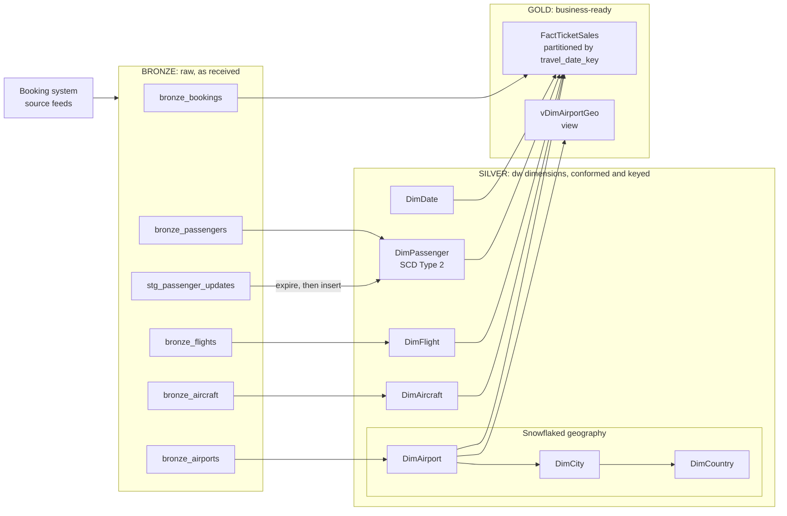
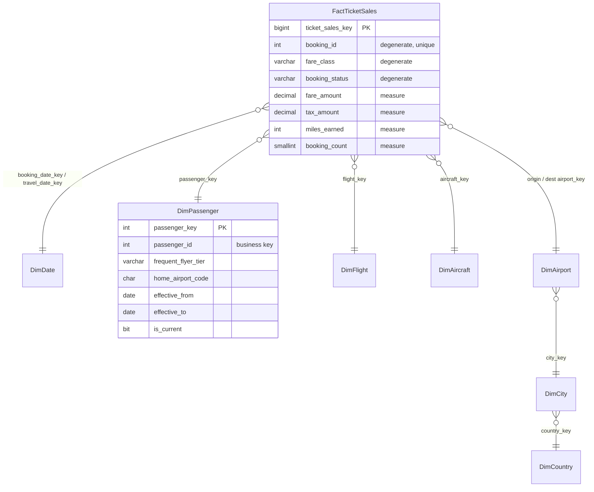

# Vayu Air: Warehouse Design Challenge

A mini data-warehouse project on **SQL Server (T-SQL, run in SSMS)**. It models raw airline booking data into a star schema with a snowflaked geography, a Type 2 passenger history, a partitioned sales fact, medallion layers and a data contract for the source feed.

---

## 1. Business problem

Vayu Air flies domestic and international routes out of India. Every analytics request hits the live booking database, so reports are slow, hard to write and disagree with each other (revenue by route, month and frequent-flyer tier). The goal is a warehouse that answers these questions **quickly and consistently**, and keeps **historical reports honest** when passengers change tier or home airport.

**Business rule:** revenue uses `booking_status = 'Confirmed'` unless stated otherwise.

---

## 2. Architecture

### Star schema with snowflaked geography

---

## 3. Data

| Table | Rows | Description |
|---|---|---|
| `bronze_bookings` | 40,000 | One row per ticket sold |
| `bronze_flights` | 2,000 | Flight schedule (route, aircraft, date) |
| `bronze_passengers` | 1,500 | Passenger master with tier and home airport |
| `bronze_airports` | 24 | Airports with city, country and region |
| `bronze_aircraft` | 10 | Aircraft types |
| `stg_passenger_updates` | 250 | Daily change feed: 200 changed passengers, 50 new |

Profiling findings that shaped the design:

- `booking_id` is unique, and every booking resolves to a flight, passenger, airport and aircraft (no orphans).
- `travel_date` always equals the flight's `flight_date`, so `flight_date` is dropped from the fact.
- The same passenger and flight pair can appear more than once, so the grain is the **booking**, not the passenger-flight.
- 43 bookings are dated before the passenger's `signup_date`, so the first SCD2 version starts at `1900-01-01`.
- Of the 200 changed passengers: 109 changed tier only, 9 home airport only, 82 both.

---

## 4. Tasks and deliverables

| # | Task | Script |
|---|---|---|
| 1 | Grain statement and dimension-key vs measure classification | see section 5 |
| 2 | Star schema DDL in a `dw` schema | `star_schema_ddl_tsql.sql` |
| 3 | Load dimensions (incl. `DimDate` with yyyymmdd key) and fact, with validation | `load_star_schema_tsql.sql` |
| 4 | Snowflake geography: airport, city, country | `snowflake_geography_tsql.sql` |
| 5 | SCD Type 2 passenger dimension, expire-then-insert | `scd2_passenger_tsql.sql` (full) or `scd2_passenger_simple_tsql.sql` (short) |
| 6 | Partition the fact by date, compare two queries in the actual plan | `partition_fact_tsql.sql` |
| 7 | Medallion mapping and bronze_bookings data contract | sections 6 and 7 |

### Run order

1. `star_schema_ddl_tsql.sql`
2. `load_star_schema_tsql.sql`
3. `snowflake_geography_tsql.sql`
4. `scd2_passenger_tsql.sql` (or the simple version)
5. `partition_fact_tsql.sql`

Before step 2, load the six CSV files into SQL Server as `dbo.bronze_bookings`, `dbo.bronze_flights`, `dbo.bronze_passengers`, `dbo.bronze_airports`, `dbo.bronze_aircraft` and `dbo.stg_passenger_updates` (SSMS: right-click the database, Tasks, Import Flat File). Adjust the schema prefix in the scripts if yours differs.

---

## 5. Design decisions

**Grain of `FactTicketSales`:** one row per booking (`booking_id`): a single passenger's booking on a single flight, in one fare class, with its status.

| Role | Columns |
|---|---|
| Dimension keys | `passenger_id`, `flight_id`, `booking_date`, `travel_date`, `origin_airport_code`, `dest_airport_code`, `aircraft_code` |
| Degenerate dimensions | `booking_id`, `fare_class`, `booking_status` |
| Measures (additive) | `fare_amount`, `tax_amount`, `miles_earned`, `booking_count` |
| Dropped | `flight_date` (duplicate of `travel_date`) |

Ratios such as tax as a share of fare are **not** additive: recompute them as `SUM(tax) / SUM(fare)`. Also, `fare_amount` is populated on Cancelled and NoShow rows, so filter on `booking_status` when summing revenue.

**Snowflaked geography:** `DimAirport` points to `DimCity`, which points to `DimCountry`. *Trade-off:* it removes repeated city, country and region text, but every query that needs a country or region takes two extra joins. A flattened view, `vDimAirportGeo`, hides that for BI users.

**SCD Type 2 passenger:** tracks `frequent_flyer_tier` and `home_airport_code`. Step 1 expires the current version when a tracked value changed (`is_current = 0`, `effective_to` set to the day before the load date). Step 2 inserts a new current version for every staged passenger without a current row, which covers both changed and brand-new passengers. Dates are inclusive and current rows end at `9999-12-31`. Staging has no change date, so the load date is the effective date.

**Partitioning:** `FactTicketSales` is partitioned monthly on `travel_date_key` (`RANGE RIGHT`, 24 partitions, data in partitions 1 to 15). The clustered index is built on the partition scheme and the primary key is kept non-aligned on `[PRIMARY]`.

---

## 6. Medallion layers

| Table | Layer | Why |
|---|---|---|
| `bronze_bookings`, `bronze_flights`, `bronze_passengers`, `bronze_airports`, `bronze_aircraft` | Bronze | Raw source feeds, unchanged |
| `stg_passenger_updates` | Bronze | Raw landing of the change feed, not yet applied |
| `DimDate` | Silver | Generated reference calendar shared by all facts |
| `DimPassenger` | Silver | Cleaned and historized (SCD2) with surrogate keys |
| `DimAirport`, `DimCity`, `DimCountry` | Silver | Conformed, normalised geography |
| `DimAircraft`, `DimFlight` | Silver | Conformed reference entities with surrogate keys |
| `FactTicketSales` | Gold | One row per booking, additive measures, partitioned for reporting |
| `vDimAirportGeo` | Gold | Flattened reporting view |

This pipeline goes straight from bronze to the star schema, so there is no separate silver table set. Many teams label the whole star schema gold, which is also valid.

---

## 7. Data contract: `bronze_bookings`

> The SLA, owner and notice period are **proposals** and must be confirmed by the real feed owner. The schema and rules were checked against the 40,000 rows provided.

**Schema**

| Column | Type | Null? | Rule |
|---|---|---|---|
| `booking_id` | INT | No | Primary key, unique |
| `passenger_id` | INT | No | Must exist in `bronze_passengers` |
| `flight_id` | INT | No | Must exist in `bronze_flights` |
| `booking_date` | DATE | No | Not later than `travel_date` |
| `travel_date` | DATE | No | Equals the flight's `flight_date` |
| `fare_class` | VARCHAR(20) | No | `Economy`, `Premium Economy`, `Business`, `First` |
| `fare_amount` | DECIMAL(12,2) | No | Greater than 0 |
| `tax_amount` | DECIMAL(12,2) | No | Greater than or equal to 0 |
| `booking_status` | VARCHAR(20) | No | `Confirmed`, `Cancelled`, `NoShow` |
| `miles_earned` | INT | No | Greater than or equal to 0 |

- **Delivery SLA (proposed):** one full file per day by 06:00 UTC; late after 08:00 UTC.
- **Quality gates:** no nulls, unique `booking_id`, no orphan IDs, allowed values only.
- **Owner (to confirm):** the booking platform team. Consumer: the data warehouse team.
- **Open item:** the feed has no currency column. Confirm which currency the amounts are in.
- **Breaking change example:** adding a new `fare_class` value such as `Basic`, or renaming `fare_amount`.
- **Non-breaking change example:** adding a new optional column at the end, such as `booking_channel`.
- **Notice period (proposed):** 14 days for breaking changes.

---

## 9. Tech stack

- SQL Server with T-SQL, run in SSMS
- Mermaid for the diagrams in this README (renders on GitHub)
